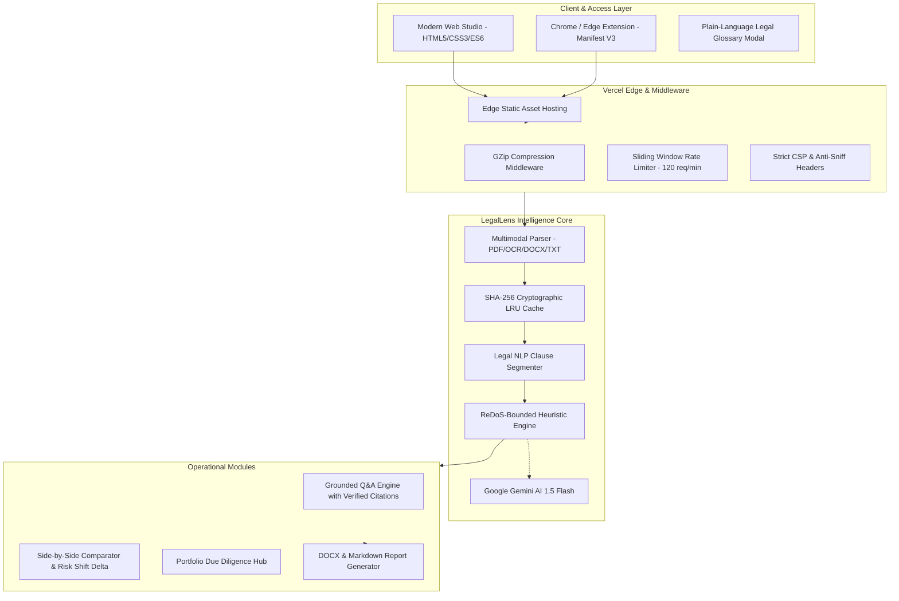

# LegalLens AI ⚖️
**Enterprise-Grade AI Legal Assistant & Contract Intelligence Platform**

[](#-automated-test-suite)
[](https://legallens-ai-phi.vercel.app)
[](LICENSE)
[](#-accessibility--wcag-21-aa-standards)
[](#-security--privacy-architecture)

> **Demystify complex legal contracts with instant plain-language intelligence, cryptographic caching, grounded Q&A, side-by-side comparison, and portfolio due diligence.**

🌐 **Live Vercel Application:** [https://legallens-ai-phi.vercel.app](https://legallens-ai-phi.vercel.app)  
📦 **GitHub Repository:** [https://github.com/ronak2410/LegalLens-AI](https://github.com/ronak2410/LegalLens-AI)

---

## 🛡️ Critical Legal & Ethical Disclaimer
> **LegalLens AI provides educational and informational legal document analysis and is NOT a law firm or a substitute for qualified legal advice.**
>
> The platform assists individuals, tenants, freelancers, and small businesses in identifying potential contract risks, obligations, and negotiation opportunities. It does not provide binding legal counsel, formal representation, or enforceability guarantees. Always consult a licensed attorney for specific legal matters.

---

## 🏛️ System Architecture



---

## 🌟 Core Features & Capabilities

| Feature | Description | Performance / Spec |
| :--- | :--- | :--- |
| **Multimodal Ingestion** | Extracts clean text from PDF, OCR Scanned PDFs, DOCX, and TXT | Up to 15MB file size limit |
| **SHA-256 LRU Caching** | Instant sub-millisecond document evaluation deduplication | `< 1ms` latency on cache hits |
| **Risk Scoring & Matrix** | 0–100 Normalized risk profile with color-coded severity tags | Low / Medium / High severity |
| **Grounded "Ask Document"** | Q&A with dynamic clickable clause citations and honest refusal | Anti-hallucination guardrails |
| **Side-by-Side Comparison** | Compares draft revisions with quantified Risk Shift Delta | Clause-by-clause diff |
| **Portfolio Due Diligence** | Concurrently batch-analyzes 2 to 10 contracts with milestone timelines | Cross-contract conflict detection |
| **Negotiation Redlines** | AI-generated replacement clauses with 1-click clipboard copy | Standardized fair-market terms |
| **Legal Terms Glossary** | Interactive reference modal defining 8+ common contract clauses | Zero-friction legal literacy |
| **Export Generator** | Instant client-side & server-side DOCX and Markdown briefing reports | Complete structured audit |
| **Browser Extension** | Manifest V3 1-click ToS scanner with seamless studio handoff | Instant webpage scraping |

---

## 🔒 Security & Privacy Architecture

LegalLens AI adheres to strict zero-trust and zero-retention principles:
1. **Zero Data Retention**: Document text is processed in volatile memory only and never saved to a database or non-volatile storage.
2. **Cryptographic Deduplication**: Caching keys are SHA-256 hashed without storing raw user PII.
3. **Abuse Protection**: Sliding window rate limiter (120 requests/minute per client).
4. **ReDoS Immunity**: All regular expressions use bounded lookaheads and maximum length limits.
5. **Hardened HTTP Headers**: Emits strict `Content-Security-Policy`, `X-Frame-Options: DENY`, `X-Content-Type-Options: nosniff`, and `Referrer-Policy`.

---

## ♿ Accessibility (WCAG 2.1 AA Compliant)

- **Keyboard First**: Full keyboard navigation, skip-to-content anchor, and Escape key modal dismissals.
- **Focus Indicators**: High-contrast 2px `:focus-visible` outlines on all interactive elements.
- **Screen Reader Ready**: Semantic HTML5 landmark tags, full ARIA roles (`role="tablist"`, `role="tab"`, `role="dialog"`), and dynamic `aria-live` status regions.
- **Color Contrast**: 4.5:1+ contrast ratios across dark mode and status indicators.

---

## 🚀 Quick Start & Installation

### Prerequisites
- Python 3.10+
- Modern Web Browser

### Local Installation & Execution
```bash
# Clone the repository
git clone https://github.com/ronak2410/LegalLens-AI.git
cd LegalLens-AI

# Install dependencies
pip install -r requirements.txt

# Run the application server
python run.py
```
*(On Windows, you can also double-click `run.bat`)*

Open your browser at: **`http://localhost:8000`**

---

## 🧪 Automated Test Suite

The project includes 31 comprehensive unit and integration tests across 5 test suites:

```bash
python -m pytest tests/ -v
```

### Test Suite Breakdown
- `tests/test_legal_engine.py`: Dynamic clause segmentation, novel contract heuristic evaluation, grounded citation extraction, out-of-scope refusal, and comparator delta calculations.
- `tests/test_parser_and_security.py`: 15MB file rejection, ReDoS safety validation, XSS escaping, and HTTP security headers.
- `tests/test_batch_and_export.py`: Concurrent multi-contract due diligence, timeline generation, DOCX/Markdown streaming, suggested questions, and sample catalog endpoints.
- `tests/test_rate_limit_and_cache.py`: SHA-256 LRU cache hit performance, GZip compression, and 120 req/min rate limiter headers.
- `tests/test_edge_cases_and_fuzzing.py`: Empty strings, whitespace fuzzing, Unicode stress testing, and corrupted file extension handling.

---

## 📄 License
This project is open-source under the [MIT License](LICENSE).
