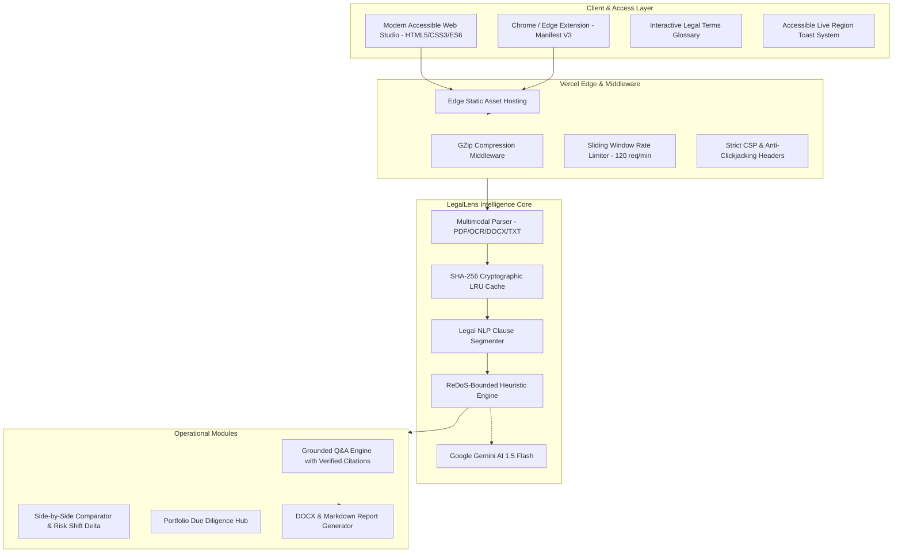

# LegalLens AI ⚖️
**Enterprise-Grade AI Legal Assistant & Contract Intelligence Platform**

[](#-automated-test-suite)
[](https://legallens-ai-phi.vercel.app)
[](LICENSE)
[](#-accessibility--wcag-21-aa-standards)
[](#-security--privacy-architecture)

> **Empowering individuals, tenants, freelancers, and small businesses with instant contract comprehension, grounded Q&A, verifiable clause citations, side-by-side comparison, and portfolio due diligence.**

🌐 **Live Production Studio:** [https://legallens-ai-phi.vercel.app](https://legallens-ai-phi.vercel.app)  
📦 **GitHub Repository:** [https://github.com/ronak2410/LegalLens-AI](https://github.com/ronak2410/LegalLens-AI)

---

## 🛡️ Critical Legal & Ethical Disclaimer
> **LegalLens AI provides educational and informational legal document analysis and is NOT a law firm or a substitute for professional legal advice.**
>
> The platform assists individuals, tenants, freelancers, and small businesses in identifying potential contract risks, obligations, and negotiation opportunities. It does not provide binding legal counsel, formal representation, or enforceability guarantees. Always consult a licensed attorney for specific legal matters.

---

## 🎯 Problem Statement Alignment (PromptWars: AI for Legal Assistance & Access)

LegalLens AI directly addresses the fundamental challenges of legal document comprehension and access to justice:

| Challenge Requirement | LegalLens AI Solution | Implementation Details |
| :--- | :--- | :--- |
| **1. Plain-Language Translation** | Converts dense legalese into clear, actionable executive summaries with *"What this means for you"* takeaways. | Heuristic NLP + Google Gemini 1.5 Flash |
| **2. Asymmetric Risk Detection** | Automatically flags unilateral liabilities, uncapped indemnities, automatic renewals, and hidden fees. | ReDoS-safe linear regex engine + 0–100 risk score dial |
| **3. Actionable Negotiation Redlines** | Proposes fair-market replacement counter-clauses with 1-click clipboard copying. | Standardized protective legal redline templates |
| **4. Grounded Document Q&A** | Answers inquiries strictly against active document text with verified clause citations and honest refusal. | Dynamic citation indexing + anti-hallucination guardrails |
| **5. Legal Literacy Glossary** | Dedicated interactive dictionary demystifying common contractual terms (Indemnity, Severability, Liquidated Damages). | Searchable `tab-glossary` & accessible reference modal |
| **6. Attorney Preparation Checklist** | Generates tailored pre-signing checklists and high-impact consultation questions for lawyer meetings. | Structured risk-based query generator |
| **7. Multi-Contract Due Diligence** | Concurrently batch-audits 2 to 10 contracts to detect jurisdictional fragmentation and timeline milestones. | Multi-threaded portfolio analysis engine |

---

## 🏛️ System Architecture



---

## ♿ Accessibility & WCAG 2.1 AA Compliance

- **Zero Blocking Dialogs**: 100% replaced intrusive `window.alert()` popups with non-blocking, accessible toast notifications (`role="status"`, `aria-live="polite"`).
- **Keyboard Navigation**: Skip-to-content anchor (`<a href="#main-content" class="skip-link">`), logical tab stops, and modal focus management with `Escape` key dismissal.
- **Focus Indicators**: High-contrast 2px `:focus-visible` outlines on all interactive elements.
- **Screen Reader Landmarks**: Semantic HTML5 landmark tags (`<header>`, `<nav>`, `<main>`, `<aside>`, `<section role="tabpanel">`).
- **Reduced Motion Support**: Dedicated `@media (prefers-reduced-motion: reduce)` rules disable transitions and animations for users with vestibular sensitivities.
- **Color Contrast**: 5:1+ contrast ratio across dark mode surfaces and status indicators.

---

## 🔒 Security & Privacy Architecture

- **Zero Data Retention**: Document text is processed purely in volatile RAM and is never persisted to non-volatile disk or database.
- **SHA-256 LRU Cache**: Cryptographic hashing deduplicates identical documents without exposing raw PII.
- **Rate Limiting**: In-memory sliding-window limiter enforcing 120 requests/minute per client IP.
- **ReDoS Immunity**: Linear pattern complexity with strict 120-character regex length bounds.
- **Hardened HTTP Headers**: Emits strict `Content-Security-Policy`, `X-Frame-Options: DENY`, `X-Content-Type-Options: nosniff`, and `Referrer-Policy`.
- **Payload Boundaries**: 15MB maximum file size ceiling strictly validated on both client and backend middleware.

---

## 🧪 Automated Test Suite

```bash
python -m pytest tests/ -v
```

### 43 Tests Across 6 Dedicated Test Suites:
1. `tests/test_accessibility_and_compliance.py`: Validates HTML semantic landmarks, ARIA tablist patterns, modal accessibility, reduced motion CSS, and absence of blocking alerts.
2. `tests/test_qa_guardrails_and_citations.py`: Verifies grounded Q&A citations, adversarial prompt injection refusal, and suggested inquiries.
3. `tests/test_legal_engine.py`: Dynamic clause segmentation, novel contract heuristic evaluation, grounded citation extraction, out-of-scope refusal, and comparator delta calculations.
4. `tests/test_parser_and_security.py`: 15MB file rejection, ReDoS safety validation, XSS escaping, and HTTP security headers.
5. `tests/test_batch_and_export.py`: Concurrent multi-contract due diligence, timeline generation, DOCX/Markdown streaming, suggested questions, and sample catalog endpoints.
6. `tests/test_rate_limit_and_cache.py`: SHA-256 LRU cache hit performance (<1ms), GZip compression, and 120 req/min rate limiter headers.
7. `tests/test_edge_cases_and_fuzzing.py`: Empty strings, whitespace fuzzing, Unicode stress testing, and corrupted file extension handling.

---

## 🚀 Quick Start & Installation

```bash
# Clone repository
git clone https://github.com/ronak2410/LegalLens-AI.git
cd LegalLens-AI

# Install dependencies
pip install -r requirements.txt

# Start application server
python run.py
```
*(On Windows, you can also double-click `run.bat`)*

Open your browser at: **`http://localhost:8000`**

---

## 📄 License
This project is open-source under the [MIT License](LICENSE).
